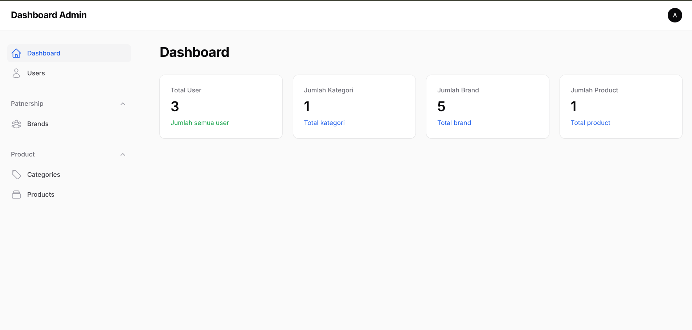
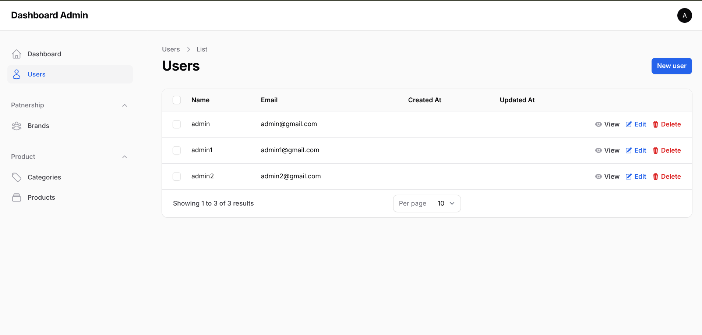
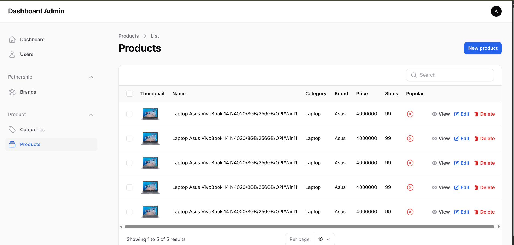
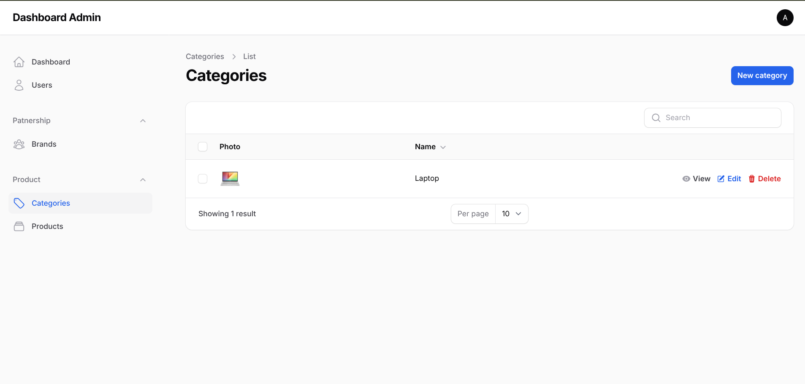

# Data Diri
- Silvanus Kukuh Prasetyo (A11.2023.14963)

# Dokumentasi Program CRUD Laravel


## Deskripsi Program
Project ini merupakan aplikasi CRUD (Create, Read, Update, Delete) menggunakan Laravel 12, MySQL, dan Docker.
Aplikasi mendukung manajemen data berikut:
- User
- Category
- Brand
- Product

Aplikasi juga dilengkapi dengan fitur Upload Gambar, Seeder & Factory, Filament Dashboard, serta integrasi storage untuk file upload.

## Cara menjalankan
- Build up docker compose
```bash
docker compose up -d
```
- Install dependensi laravel
```bash
docker exec -it crud-laravel composer install
```
- Install dependensi NPM
```bash
docker exec -it crud-laravel npm install
```
- Aktifkan storage link
```bash
docker exec -it crud-laravel php artisan storage:link
```
- Migrate dan seeding database
```bash
docker exec -it crud-laravel php artisan migrate:fresh --seed
```
- Akses aplikasi di http://127.0.0.1:8080/
```bash
http://127.0.0.1:8080/
```
- Login menggunakan email admin@gmail.com dengan password 123
```bash
Email : admin@gmail.com
Password : 123
```
# Fitur Program
## CRUD User

## CRUD Product

## CRUD Category

## CRUD Brand
